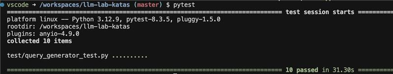

# Solutions for [LLM Lab katas](https://github.com/dmitry-buykin/llm-lab-katas)

Reproducible working environment is provided via VSCode Dev Containers. When creating from scratch, make a copy of [.devcontainer/devcontainer.env.template](.devcontainer/devcontainer.env.template) file and save it as `.devcontainer/devcontainer.env`, then put OpenAI API key there.

To download the dataset, use [the sandbox Jupyter notebook](./sandbox.ipynb), then copy the source SQLite database file into `.data/olist.sqlite`.

Currently there is a solution for [assignment #1](https://github.com/dmitry-buykin/llm-lab-katas/blob/main/1-entry-assignment.md) with all tests passing most of the time. This code is tagged as [assignment-1](https://github.com/igor-lobanov-maersk/llm-lab-assignments/tree/assignment-1)



## Instructions

To run all tests use `pytest` command:

```sh
pytest
```

To run only some tests set `RUN_ONLY` environment variable containing one or more letters A-J to run only respective tests. For example the following command will run the first, the third, and the sixth tests:

```sh
RUN_ONLY="ACF" pytest 
```
